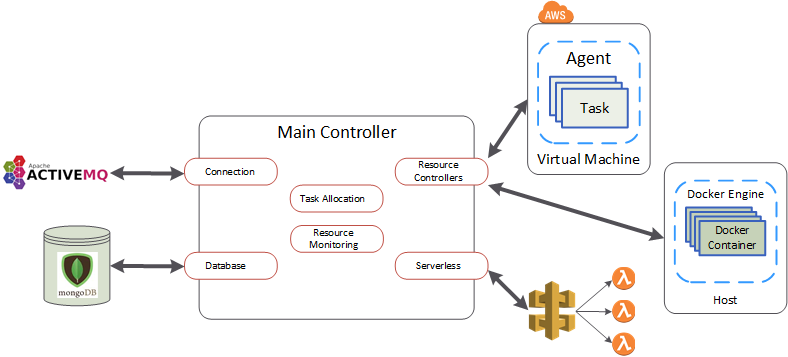
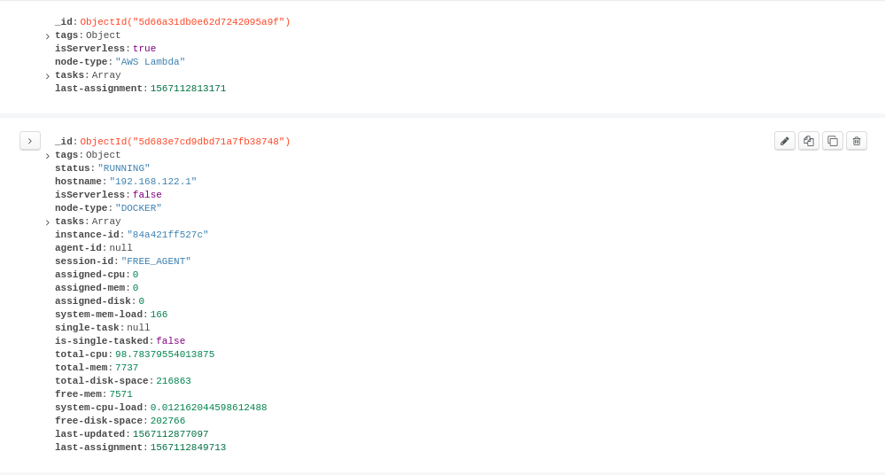

Development Setup and Tips & Tricks
===================================

Scott Bennett, scott.bennett@caci.com

The purpose of this document is to make starting new on CCDP less of a pain-staking process, allowing a new developer to be up and running quickly with a good understanding of the program architecture.

The first section will take you through the set up process, preparing your system to work and develop in CCDP

The second section will be a high level walk through of the program architecture, introducing components, their purpose, and how they interface with the rest of the system.

The third section will be a bunch of tips and tricks that I have compiled to hopefully help with debugging and development.

System Setup
------------

Before anything, make sure that all the necessary dependencies are installed:

- Java 12, https://www.oracle.com/technetwork/java/javase/downloads/jdk12-downloads-5295953.html
- Ant 1.10, https://ant.apache.org/bindownload.cgi

After installing the dependencies, programs that are needed for development and debugging are needed. My personal recommendations are:

- Eclipse IDE for Java Developers, https://www.eclipse.org/
- Visual Studio Code, https://code.visualstudio.com/
- Terminator, a better terminal, *yum install terminator*

Now that dependencies and applications are install, it's time to configure the environment. A workspace should be designated for Eclipse, so use the following commands to make a new directory for the workspace and finally clone the repo:

```shell
# Go to home directory
ps1:~$: cd ~

# Make a new directory for the workspace
ps1:~: mkdir workspace
```

I recommend always launching Eclipse from terminal. This allows Eclipse to use your environment variables set in your *.bashrc* file to be active inside Eclipse. To ensure this also happens, add the line
*source /etc/environment*
to your *.bashrc* file. This forces the variables to be sourced.

The following is a list of aliases located in my *.bash_aliases* file, that gets run at a point in my *.bashrc* file. This sets a bunch of keyboard shortcuts and environment variabes:

```bash
export JAVA_HOME="/usr/java/latest" 
# Latest is a soft link to the latest version of JDK, 12 in my case

export ANT_HOME="{Path to Ant Home}/apache-ant"

export PATH="${JAVA_HOME}/bin:${ANT_HOME}/bin:$PATH"
export CCDP_HOME=~/workspace

# I installed eclipse at /opt
alias ejava='{Path to Eclipse}/eclipse/eclipse & disown'
```

The above code block can be copy and pasted into your *.bashrc* file. You can then use the alias set above to open Eclipse.

```shell
ps1:~$ ejava
```

When Eclipse opens, it asks for your project workspace, at which time you can designate the workspace folder we just created.

The final step to set up is to download the CCDP Client jar file. After you create your own Java project, you will be able to add the *ccdp-client.jar* file to your class path by:
Select 'Project' from the top bar on Eclipse -> Properties -> Java Build Path -> Add External JARs -> Add *ccdp-client.jar* to ClassPath
At this point, you are ready to start using adding your own features to the CCDP tool, allowing easy resource monitor and task allocation for large systems.

An In Depth Look into CCDP
--------------------------


<center>CCDP Engine Architecture</center>

In order to give reference and have a concrete example to refer back to, I'm going to give the following information:

- When developing the Engine, the types of resources (VMs) that I used for testing were Docker and AWS EC2. For the majority of this section, I will refere to them as the resources, but the same concepts can be derived for whatever resoruce you are implementing CCDP Engine support.

For reference, I used the following services to implement interfaces:

- Active MQ for the Connection Interface
- MongoDb for the Database Interface
- AWS and Docker for the Resources *(Each resource needs a resource controller)*
- AWS Lambda and Local Bash Session for Serverless Interfaces
- Two different task allocation, used to determine how task are distrubuted to the engine's resources

All interfaces are required to be implemented in at least one way or the engine will work unexpectedly. Before defining the connections, I'm going to define a few terms that I will use to explain system components:

- Resource: An instance of a server-bound or server-free target that can execute tasks assigned by the Engine.
- Agent: A server-bound resource that requires a host, local or remote, to run tasks
- Serverless: A server-free resource that doesn't need a host to execute *(AWS Lambda for example)*

Its important to note that agents are physical machine running tasks, while serverless operations don't require a host to execute code.

####The Connection Interface

The purpose of the connection interface is to provide a method for the main controller, or engine, to communicate with the agents and serverless controllers. This allows the engine to send tasks and receive updates from the agents and serverless controllers.

The architecture for message sending, from the perspective of the Engine is simple:

- incoming messages are a 'one to many' relationship
- outgoing messages are a 'one to one' relationship.

In other words, there is a single message queue that the Engine listens to for updates and messages from all agents and serverless controllers. When a new message is received, it is dealt with according to the message type. When the Engine wants to send a message, it sends the message to a message queue exclusive to the Engine and the desired target.

**PICTURE HERE**

#####Implementation Example:

In my development, I used Active MQ. The Engine's queue to consume from was named 'ccdp-engine' and all agents and serverless controllers were configured to send their messages there. When a resource or serverless controller allocated a new resource, a unique identifier was given to it, the Engine was configured to produce message to the channel, and the newly created resource would be configured, on creation, to consume on that channel.

####The Database Interface

The purpose of the Database interface is to provide a persistent method of system status monitoring in case of unexpected crashes. It is also a powerful tool for debugging the system when resource tasking isn't behaving as expected. Every resource that is created by the Engine has an entry in the database as long as the resource is still active. If a resource is terminated by the Engine, its database entry is deleted. 

The database fields and types for agents are:

- Map<String, String> tags: Additional tags to add to the resource
- String status: The status of the resource *("Launched", "Running", "Shutting Down", etc)*
- String hostname: The hostname of the resource
- boolean isServerless: Whether the resource is a serverless resource or not *(should be false for agents)*
- String node-type: The type of node the resource is
- List\<CcdpTaskRequest> tasks: A list of task requests assinged to the resource
- String instance-id: A unique identifier applied to the resource
- String session-id: The session that the Engine assigned to the resource
- int assigned-cpu: The assigned CPU to the resource by the allocator
- int assigned-mem: The assigned memory (RAM) to the resource by the allocator
- int assigned-disk: The assigned disk space to the resource by the allocator
- int total-cpu: The total CPU available to the resource
- int total-mem: The total memory (RAM) available to the resource
- int total-disk-space: The total disk space available to the resource
- int free-mem: The current free memory (RAM) available to the resource
- int system-cpu-load: The current CPU load used by the resource
- int free-disk-space: The current free disk space available to the resource
- boolean is-single-tasked* Whether the resource is single tasked*
- CcdpTaskRequest single-task: The task that is causing the resource to be single tasked, null if not single tasked
- last-updated: The last time the resource was updated by an Engine probe
- last-assignment: The last time the resource was assigned a tasked by the task allocator

*\* Note: a task makes a resource "single tasked" if the task is given all of the agent's allocated CPU processing power*

The database field sand types for serverless resources are:

- Map<String, String> tags: Additional tags to add to the resource
- boolean isServerless: Whether the resource is a serverless resource or not *(should be true for serverless resources)*
- String node-type: The name of the service the controller corresponds to
- List\<CcdpTaskRequest> tasks: A list of task requests assinged to the resource
- last-assignment: The last time the resource was assigned a tasked by the task allocator

As stated earlier, I used MongoDb to implement the Database interface with my database entries looking like the following:

<center>Database Interface Implementation</center>
